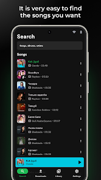

# SoundSpot 🎵

[](https://play.google.com/store/apps/details?id=com.kuvandikov.soundspot)

SoundSpot is a simple and elegant music app developed using **Jetpack Compose** for creating modern UI components in Android. This project marks my first experience transitioning from traditional **XML** layouts to Jetpack Compose, providing a better, more efficient way to develop Android apps.

## Features ✨

- 🎶 **Music Playback**: Stream or play music files from your device with ease.
- 🎨 **Modern UI**: Created entirely using Jetpack Compose, offering a clean and responsive design.
- 💡 **Light & Dark Themes**: Automatically switch between themes depending on system settings.
- 📦 **Simple & Fast**: Focused on performance and user experience, optimized for both speed and ease of use.

## Screenshots 📸

| Home Screen | Music Player |
|-------------|--------------|
|  |  |

## Technologies Used 🛠

- **Jetpack Compose**: Modern toolkit for building native UI in Android.
- **Kotlin**: 100% Kotlin-based app.
- **Coroutines**: For asynchronous programming.
- **MediaPlayer API**: Used for music playback.

## How to Build 🔧

1. Clone the repository:
   ```bash
   git clone https://github.com/kuvandikov/soundspot.git
